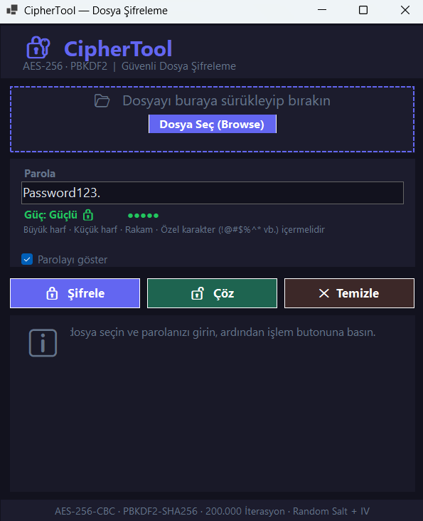

## 🔐 CipherTool – Secure File Encryption


**CipherTool**, dosyalarınızı askeri düzeyde güvenlik standartları ile şifreleyen, modern arayüze sahip bir Windows masaüstü uygulamasıdır.  
Geliştiriciler ve güç kullanıcıları için tasarlanmış, hem **şık** hem de **kullanımı çok basit** bir araçtır.

---

## 📚 İçindekiler

- **[📸 Uygulama Görünümü](#-uygulama-görünümü)**
- **[✨ Özellikler](#-özellikler)**
- **[🧠 Mimarinin Özeti](#-mimarinin-özeti)**
- **[🚀 Kurulum & Çalıştırma](#-kurulum--çalıştırma)**
- **[🧪 Kullanım Senaryoları](#-kullanım-senaryoları)**
- **[⚙️ Geliştirici Rehberi](#️-geliştirici-rehberi)**
- **[🔐 Güvenlik Notları](#-güvenlik-notları)**
- **[📄 Lisans (MIT)](#-lisans-mit)**

---

## 📸 Uygulama Görünümü



> **Not:** Görsel, projenin varsayılan karanlık temasını göstermektedir. UI bileşenleri, sade ve göz yormayan bir tasarım yaklaşımı ile hazırlanmıştır.

---

## ✨ Özellikler

- **🛡️ Maksimum Güvenlik**
  - AES-256-CBC algoritması ile güçlü simetrik şifreleme.
  - Rastgele üretilen **Salt** ve **IV** değerleri ile her işlem için benzersiz şifreleme.

- **🔑 Akıllı Anahtar Türetme**
  - Parola doğrudan anahtar olarak kullanılmaz.
  - PBKDF2 tabanlı anahtar türetme ve yüksek iterasyon sayısı ile brute-force saldırılarına karşı dayanıklı yapı.

- **🎨 Modern & Karanlık Arayüz**
  - Geliştirici dostu, VS Code / Cursor benzeri **dark theme**.
  - Basit, odaklı ve dikkat dağıtmayan layout.

- **🖱️ Sürükle-Bırak Desteği**
  - Dosyayı uygulama penceresine sürükleyip bırakarak hızlı şifreleme / çözme.

- **⚡ Optimize Performans**
  - Büyük dosyalar için optimize edilmiş dosya okuma/yazma akışı.
  - UI’nin donmaması için uygun iş parçacığı kullanımı (asenkron yapı).  

---

## 🧠 Mimarinin Özeti

| Katman            | Açıklama                                                                 |
|-------------------|--------------------------------------------------------------------------|
| **UI**            | Kullanıcının dosya seçimi, parola girişi ve işlem durumunu gördüğü arayüz. |
| **Crypto Service**| AES-256-CBC, PBKDF2, Salt/IV üretimi ve dosya şifreleme/çözme mantığı.   |
| **File Layer**    | Dosya akışlarını yönetir, `.cipher` uzantılı paketleri oluşturur/okur.   |

Şifreleme sırasında dosya içeriği; **Salt**, **IV** ve şifrelenmiş veri ile birlikte güvenli bir formatta saklanır. Çözme tarafında ise bu metadata kullanılarak doğru anahtar yeniden türetilir.

---

## 🚀 Kurulum & Çalıştırma

### 1. Depoyu Klonla

```bash
git clone https://github.com/kullaniciadi/CipherTool.git
cd CipherTool
```

### 2. Visual Studio ile Aç

- **Visual Studio 2022** veya uyumlu bir sürüm ile `CipherTool.sln` çözüm dosyasını aç.
- Üst menüden **Build → Build Solution** deyip projeyi derle.

### 3. Uygulamayı Çalıştır

- Başarılı derlemeden sonra **Start / F5** ile uygulamayı çalıştır.

---

## 🧪 Kullanım Senaryoları

### 🔒 Dosya Şifreleme

1. Uygulamayı çalıştır.
2. Şifrelenecek dosyayı seç veya pencereye sürükle-bırak.
3. Güçlü bir **parola** belirle ve gir.
4. **Şifrele** butonuna tıkla.
5. Aynı klasörde `.cipher` uzantılı güvenli dosya oluşur.

### 🔓 Dosya Çözme

1. `.cipher` uzantılı dosyayı seç.
2. Dosyayı şifrelerken kullandığın **parolayı** gir.
3. **Çöz** butonuna tıkla.
4. Parola doğruysa orijinal dosya, belirlediğin konuma geri yazılır.

---

## ⚙️ Geliştirici Rehberi

- **Teknolojiler**
  - **Dil:** C#
  - **Platform:** .NET (Windows masaüstü)
  - **IDE:** Visual Studio 2022

- **Katkıda Bulunma (İsteğe Bağlı)**
  - Yeni özellik önerileri için **Issue** açabilirsin.
  - Küçük iyileştirmeler için **Pull Request** gönderebilirsin.

---

## 🔐 Güvenlik Notları

- **Parola yönetimi tamamen sana aittir.** Parolan kaybolursa, şifrelenmiş dosyayı geri döndürmek mümkün olmayabilir.
- Uygulama, şifre çözme sırasında **yanlış parolayı kurtarmaya çalışmaz**; bu, güvenlik için bilinçli bir tercihtir.
- Kritik veriler için her zaman ek yedekleme stratejileri kullanman önerilir.


